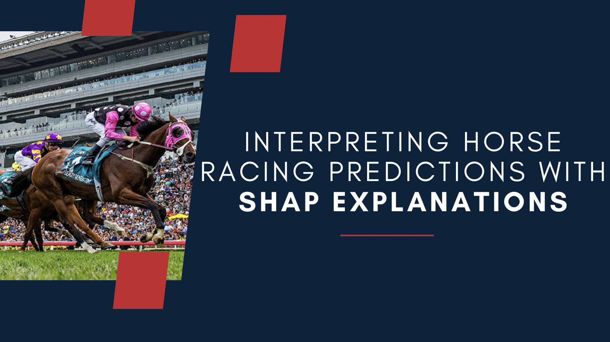

# Horse Racing Outcome Prediction with SHAP Interpretation

This repository contains the code for machine learning models designed to predict the outcomes of horse races, with SHAP (SHapley Additive exPlanations) interpretation incorporated for enhanced model interpretability. The project utilizes a diverse set of features and employs state-of-the-art algorithms, including XGBoost and TabNet.

{:width="10px"}
## Overview:
Modern horse racing, originating in the mid-to-late 1700s in England, has sustained its popularity in sports betting. This repository presents a study that delves into uncovering the influential factors affecting horse race outcomes. Utilizing the Hong Kong Horse Racing Dataset from Kaggle, we explore and analyze various machine-learning models to predict whether a horse will secure a top-three position

## Approach
Our focus is using SHAP (SHapley Additive exPlanations) to understand our models better. SHAP helps us see how each model makes predictions. We aim to provide a clear view of why our models choose certain outcomes. We also look at individual races, considering a winning and losing horse for a closer look.

## SHAP Variations
We use different versions of SHAP, like Kernel SHAP and Tree SHAP, to analyze our models. This helps us get a full picture of how the best XGBoost model and a pre-trained TabNet model come to their conclusions.

## Key Features:

### Dataset Exploration
A comprehensive exploration of the Hong Kong Horse Racing Dataset from Kaggle.

### Model Construction
Development of multiple models, including a pre-trained TabNet model and an optimized XGBoost model.

### Explainability
Interpretation of model predictions using SHAP (SHapley Additive exPlanations), including variations like Kernel SHAP and Tree SHAP.

### Local and Global Explainability
Analysis of individual predictions and exploration of global model behavior.

## Reference:
For in-depth reference on SHAP, consult the following links:

SHAP Documentation-
https://shap.readthedocs.io/en/latest/

What is SHAP- 
https://christophm.github.io/interpretable-ml-book/shap.html
https://towardsdatascience.com/using-shap-values-to-explain-how-your-machine-learning-model-works-732b3f40e137

Guide to interpreting SHAP analysis- 
https://www.aidancooper.co.uk/a-non-technical-guide-to-interpreting-shap-analyses/
